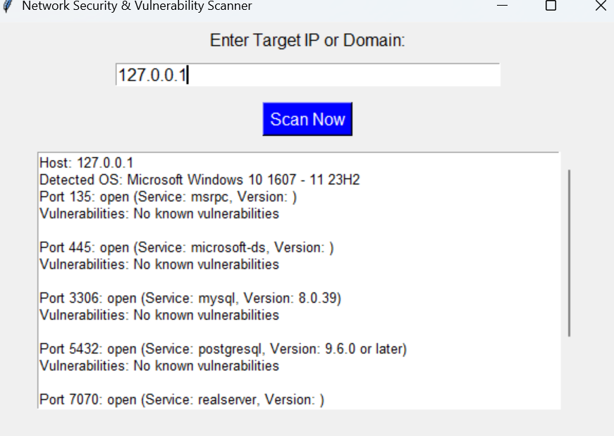

# Network Security Scanner  
A Python-based network security scanner using Nmap for reconnaissance and basic vulnerability assessment.  

## Features  
- Scans target IP/domain for open ports  
- Identifies running services and versions  
- Saves scan results as a CSV report  

## Usage  
```bash
python scanner.py
## Output Screenshot  

